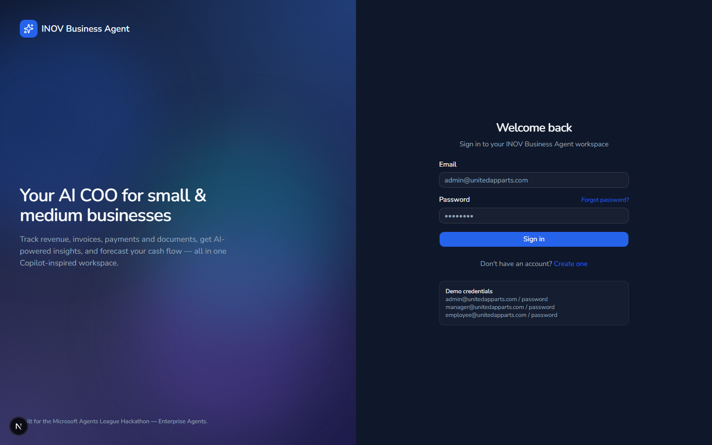

# INOV Business Agent

**INOV Business Agent** est un agent IA d'entreprise conçu pour les PME : il centralise la gestion
des clients, factures, paiements et documents, et s'appuie sur **Azure OpenAI** et **Azure AI
Search** pour fournir un chat intelligent, des prévisions de trésorerie, des rapports automatisés
et des alertes proactives.

Projet réalisé dans le cadre du **Microsoft Agents League Hackathon** (catégorie *Enterprise
Agents*).

## Sommaire

- [Fonctionnalités](#fonctionnalités)
- [Architecture du projet](#architecture-du-projet)
- [Instructions d'installation](#instructions-dinstallation)
- [Captures d'écran](#captures-décran)
- [Vidéo de démonstration](#vidéo-de-démonstration)
- [Licence](#licence)

## Fonctionnalités

- **Authentification & rôles** — inscription (création d'entreprise + admin), connexion via
  Laravel Sanctum, gestion des utilisateurs (admin / manager / employee).
- **Tableau de bord** — indicateurs clés (revenus, factures impayées, clients, profit) et
  graphiques de tendances (revenus, paiements, trésorerie).
- **Gestion des clients** — CRUD complet avec recherche.
- **Gestion des factures** — CRUD, changement de statut (en attente / payée / en retard), marquage
  "payée".
- **Suivi des paiements** — enregistrement des paiements, historique, solde restant.
- **Documents & recherche intelligente** — upload de documents (PDF/DOCX/XLSX), indexation via
  **Azure AI Search** (avec repli sur recherche SQL locale) et stockage via **Azure Blob Storage**
  (avec repli sur disque local).
- **Chat IA d'entreprise** — assistant conversationnel propulsé par **Azure OpenAI**, capable de
  répondre sur les revenus, factures, clients, prévisions et documents (avec repli local sans
  Azure).
- **Prévisions de trésorerie** — projection de trésorerie basée sur l'historique des factures et
  paiements, avec narration générée par l'IA.
- **Rapports intelligents** — génération de rapports (jour/semaine/mois/trimestre) avec résumé et
  recommandations IA, export PDF.
- **Alertes intelligentes** — détection automatique des factures en retard, documents expirés,
  etc.
- **Intégrations Azure configurables** — chaque entreprise peut connecter ses propres ressources
  Azure OpenAI / AI Search / Blob Storage depuis les paramètres (clés chiffrées en base).

## Architecture du projet

Le projet est composé de deux applications indépendantes communiquant via une API REST.

```
hackathon/
├── backend/      # API Laravel 12 (PHP 8.3, MySQL, Sanctum)
└── frontend/     # Application Next.js 15 (App Router, Tailwind v4, shadcn/ui)
```

### Backend — `backend/` (Laravel 12)

- **Authentification** : Laravel Sanctum (tokens API Bearer), middleware de rôles
  (`admin`, `manager`, `employee`).
- **Modèles principaux** (`app/Models/`) : `Company`, `User`, `Customer`, `Invoice`, `Payment`,
  `Document`, `Report`, `Alert`, `AiConversation`, `AiMessage` — toutes les entités métier sont
  rattachées à une `Company` (multi-tenant).
- **Contrôleurs API** (`app/Http/Controllers/Api/`) : `AuthController`, `CompanyController`,
  `CustomerController`, `InvoiceController`, `PaymentController`, `DocumentController`,
  `SearchController`, `ChatController`, `ForecastController`, `DashboardController`,
  `AlertController`, `ReportController`.
- **Services métier** (`app/Services/`) :
  - `AzureOpenAIService` — appelle l'API Azure OpenAI (Chat Completions) avec repli local
    (réponses templatées) si non configuré.
  - `AzureSearchService` — indexe et recherche les documents via Azure AI Search, avec repli sur
    recherche SQL `LIKE`.
  - `DocumentStorageService` — stocke les fichiers sur Azure Blob Storage ou disque local.
  - `ForecastService` — calcule les prévisions de trésorerie.
  - `ReportService` — agrège les données et génère les rapports (HTML/PDF via `dompdf`).
  - `BusinessInsightsService` — fournit les données structurées utilisées par le chat IA et les
    rapports.
- **Configuration Azure par entreprise** : chaque société peut surcharger les identifiants Azure
  globaux (`.env`) via ses propres réglages chiffrés (`settings.azure`), géré par le trait
  `ResolvesAzureConfig`.
- **Base de données** : MySQL (`inov_business_agent`), migrations + seeder de démonstration
  (`UnitedAppartsSeeder`).

### Frontend — `frontend/` (Next.js 15)

- **App Router** avec deux groupes de routes :
  - `(auth)/` : `login`, `register`, `forgot-password`.
  - `(app)/` : `dashboard`, `customers`, `invoices`, `payments`, `documents`, `ai-chat`,
    `reports`, `settings` — protégées par `middleware.ts` (redirection vers `/login` si non
    authentifié).
- **UI** : Tailwind CSS v4, composants `shadcn/ui`, thème sombre avec polices arrondies
  (Nunito / Quicksand) et animations (`motion`/Framer Motion : transitions de page, fonds animés,
  compteurs animés, etc.).
- **Communication API** : `lib/api.ts` — client `fetch` ajoutant le header
  `Authorization: Bearer <token>`, URL de base définie par `NEXT_PUBLIC_API_URL`.

## Instructions d'installation

### Prérequis

- PHP **8.3+** et Composer
- Node.js **20+** et npm
- MySQL **8+** (ou MariaDB compatible)

### 1. Cloner le dépôt

```bash
git clone https://github.com/peguy10/inov_business_agent.git
cd inov_business_agent
```

### 2. Backend (API Laravel)

```bash
cd backend
composer install
cp .env.example .env
php artisan key:generate
```

Configurer la connexion à la base de données dans `backend/.env` :

```env
DB_CONNECTION=mysql
DB_HOST=127.0.0.1
DB_PORT=3306
DB_DATABASE=inov_business_agent
DB_USERNAME=root
DB_PASSWORD=
```

Créer la base de données, exécuter les migrations et charger les données de démonstration :

```bash
php artisan migrate --seed
php artisan serve
```

L'API est alors disponible sur `http://localhost:8000` (ou le port configuré).

#### (Optionnel) Configuration Azure

Pour activer les fonctionnalités IA (chat, prévisions, rapports, recherche intelligente), définir
les variables suivantes dans `backend/.env` — sans ces clés, l'application fonctionne avec des
mécanismes de repli locaux :

```env
AZURE_OPENAI_ENDPOINT=
AZURE_OPENAI_KEY=
AZURE_OPENAI_DEPLOYMENT=
AZURE_OPENAI_API_VERSION=

AZURE_SEARCH_ENDPOINT=
AZURE_SEARCH_KEY=
AZURE_SEARCH_INDEX=

AZURE_STORAGE_ACCOUNT=
AZURE_STORAGE_KEY=
AZURE_STORAGE_CONTAINER=
```

Chaque entreprise peut également configurer ses propres identifiants Azure depuis
**Paramètres → Intégrations Azure** dans l'application (un guide PDF complet est téléchargeable
depuis cette page).

### 3. Frontend (Next.js)

```bash
cd frontend
npm install
```

Créer `frontend/.env.local` :

```env
NEXT_PUBLIC_API_URL=http://localhost:8000/api
```

Démarrer le serveur de développement :

```bash
npm run dev
```

L'application est disponible sur `http://localhost:3000`.

### 4. Connexion (compte de démonstration)

Le seeder crée une entreprise de démonstration **"United Apparts"** avec les comptes suivants
(mot de passe : `password`) :

| Rôle      | Email                          |
|-----------|--------------------------------|
| Admin     | `admin@unitedapparts.com`      |
| Manager   | `manager@unitedapparts.com`    |
| Employee  | `employee@unitedapparts.com`   |

## Captures d'écran

### Page de connexion



## Vidéo de démonstration

Une vidéo de démonstration de la plateforme (connexion, tableau de bord, clients, factures,
paiements, documents, chat IA, rapports, prévisions de trésorerie et paramètres) est disponible
dans [`docs/videos/demo.webm`](docs/videos/demo.webm) — à télécharger et lire localement (formats
GitHub n'offrent pas de lecteur intégré pour les fichiers du dépôt).

Un script détaillé ayant servi de base à cette vidéo est disponible dans
[`docs/INOV_Business_Agent_-_Guide_Utilisation_et_Script_Video.pdf`](docs/INOV_Business_Agent_-_Guide_Utilisation_et_Script_Video.pdf).

Un guide complet de fonctionnement de l'application est également disponible dans
[`docs/INOV_Business_Agent_-_Guide_de_fonctionnement.pdf`](docs/INOV_Business_Agent_-_Guide_de_fonctionnement.pdf).

## Licence

Ce projet est distribué sous licence **MIT** — voir le fichier [LICENSE](LICENSE) pour plus de
détails.
